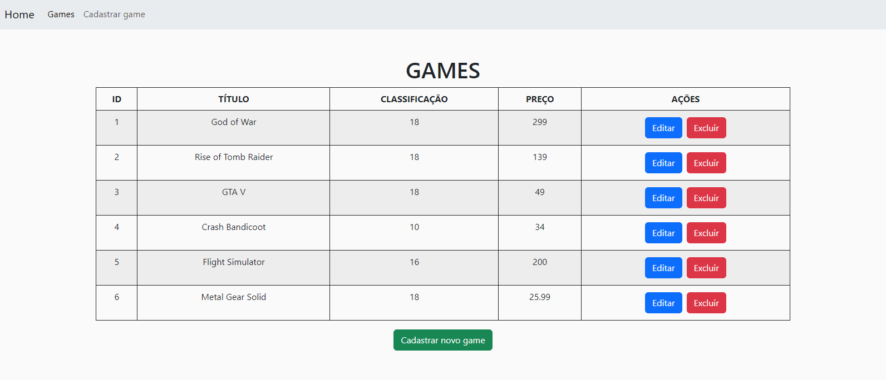

# Case-Individual-M6
## Objetivo 📍
⇨ Utilizar o padrão MVC;
⇨ Utilizar os verbos HTTP seguindo o padrão REST;
⇨ Implementar todas as operações de CRUD;

## Tecnologias 🌐
SQLite, Sequelize, Express, Axios, React, Bootstrap
  
## Como usar? :hammer:
◼ Para iniciar o banco de dados faça:

```bash
git clone https://https://github.com/FabricioSalema/Case-Individual-M6
cd back-end
npm install
npm install express
npm install nodemon
npm install sequelize
npm install sqlite3
node app.js
```
<br>
◼ para iniciar o front-end faça:

```bash
cd front-end
npm install
npm install axios
npm install react-router-dom
npm run dev
```


